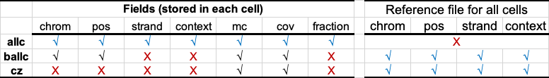
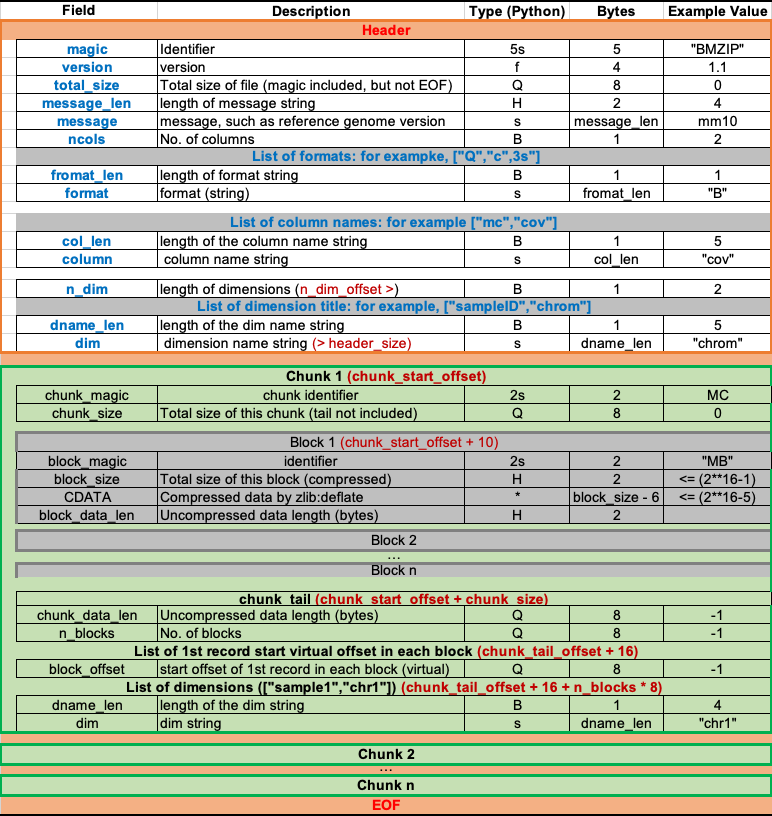

# Chunk ZIP

## Installation

```shell
pip install cytozip
#or
conda install libzlib zlib
pip install git+http://github.com/DingWB/cytozip
```
reinstall
```shell
pip uninstall -y cytozip && pip install git+http://github.com/DingWB/cytozip
```

## Implementation
|                                  | allcools | ballcools | cytozip |
| -------------------------------- | -------- | --------- | ----- |
| Format                           | .tsv.gz  | .ballc    | .cz   |
| Compression algorithm            | bgzip    | bgzip     | cytozip |
| Support Random Access ?          | Yes      | Yes       | Yes   |
| Need extra index file for query? | Yes      | yes       | No    |
| Quickly Merge?                   | No       | No        | Yes   |


<!---

-->
## Usage

[Documentation](https://dingwb.github.io/cytozip)

## Example dataset

[https://figshare.com/articles/dataset/czip_example_data/25374073](https://figshare.com/articles/dataset/czip_example_data/25374073)


## dev
```shell
python setup.py build_ext --inplace
```