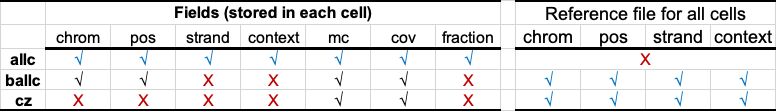
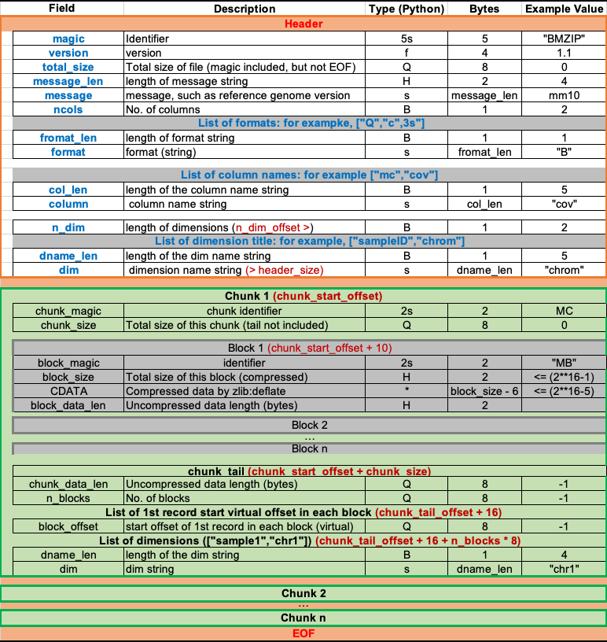

# cytozip: index-free, chunk-compressed storage for scalable single-cell DNA methylation analysis
[](https://anaconda.org/bioconda/cytozip)
[](https://anaconda.org/bioconda/cytozip)
[](https://anaconda.org/bioconda/cytozip)

A scalable, cloud-native ecosystem for single-cell and population DNA methylation analysis
## Installation
### conda
https://anaconda.org/bioconda/cytozip
```shell
mamba install -c bioconda cytozip
# or
conda install -c bioconda cytozip
```

### pip
```shell
# Prerequisites (one of):
#   conda install -c bioconda htslib libdeflate          # recommended
#   apt-get install libhts-dev libdeflate-dev            # Debian/Ubuntu
#   brew install htslib libdeflate                       # macOS
pip install cytozip
# or reinstall
pip uninstall -y cytozip && pip install git+http://github.com/DingWB/cytozip
```

## Implementation
|                                  | allcools | ballcools | cytozip |
| -------------------------------- | -------- | --------- | ----- |
| Format                           | .tsv.gz  | .ballc    | .cz   |
| Compression algorithm            | bgzip    | bgzip     | cytozip |
| Support Random Access ?          | Yes      | Yes       | Yes   |
| Need extra index file for query? | Yes      | yes       | No    |
| Quickly Merge?                   | No       | No        | Yes   |


<!---

-->
## Usage

[Documentation](https://dingwb.github.io/cytozip)

## Example dataset

[https://figshare.com/articles/dataset/cytozip_example_data/25374073](https://figshare.com/articles/dataset/cytozip_example_data/25374073)
